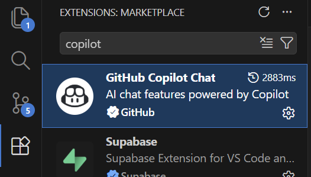
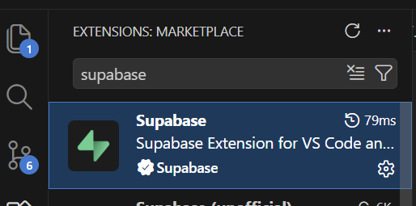
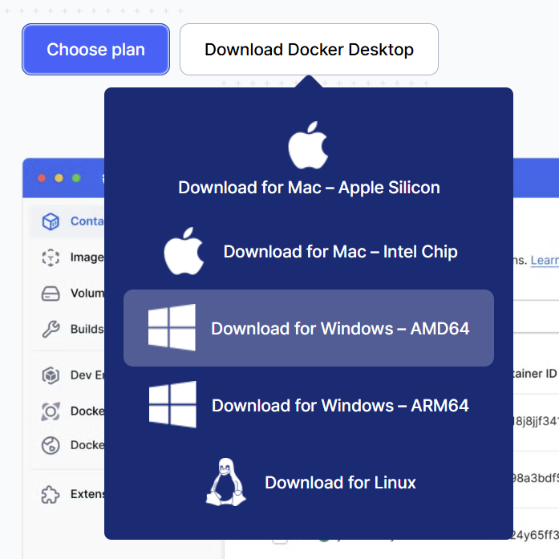
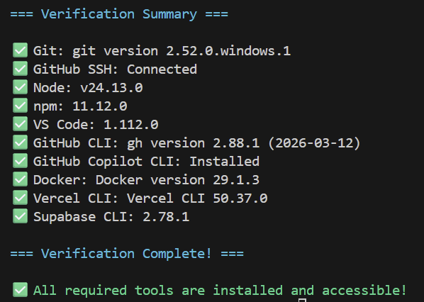

# Phase 1: AI-Assisted Full Stack Development Framework - Installation Guide

This guide provides step-by-step instructions for setting up a complete AI-assisted full stack development environment using VS Code, GitHub Copilot, and modern web development tools.

**Estimated Time: 45-90 minutes** (depending on your internet speed and system)

---

## Overview of the Stack

You'll be installing:
- **Version Control**: Git & GitHub
- **IDE & AI**: VS Code, GitHub Copilot, Copilot CLI
- **Runtime**: Node.js
- **Deployment**: Vercel
- **Backend & Database**: Supabase (PostgreSQL)
- **Local Supabase**: Docker (runs Supabase locally for development)
- **CLI Tools**: All verified and ready for Phase 2

---

## System Requirements
- **OS**: Windows 10 or Windows 11

---

## 📖 Phase 1 Contents Overview

### Step 1: GitHub & Git
- Install Git
- Create GitHub account  
- SSH key setup
- Subscribe to GitHub Copilot Individual ($10/month)

### Step 2: VS Code & Copilot
- Install VS Code
- Essential extensions:
  - GitHub Copilot (code suggestions)
  - GitHub Copilot Chat (conversational AI)
  - Supabase Extension (database interface)
  - ESLint, Prettier, Docker
- Activate GitHub Copilot

### Step 3: GitHub CLI
- Install GitHub CLI
- Authenticate with GitHub
- Install Copilot CLI extension
- Verify terminal AI assistance

### Step 4: Node.js & npm
- Install Node.js (LTS version)
- npm installation verification
- Update to latest npm

### Step 5: Docker
- Install Docker Desktop
- Configure WSL 2 (Windows)
- Verify Docker

### Step 6: Vercel
- Create Vercel account (via GitHub)
- Install Vercel CLI globally

### Step 7: Supabase
- Create Supabase account (via GitHub)
- Create first project
- Install Supabase CLI globally

### Step 8: Verification Checklist
- Run verification script: `.\.verify-installation.ps1`
- Check all tool versions
- Verify connections (GitHub SSH, etc.)
- Troubleshooting guide

---

## 1. GitHub & Git

### Step 1.1: Install Git

1. Download the latest Git installer from [https://git-scm.com/download/win](https://git-scm.com/download/win)
2. Run the `.exe` file
3. Keep all options default and click Next until installation completes

### Step 1.2: Verify Git Installation

Open PowerShell (start menu -> type powershell) and run:
```powershell
git --version
# Expected output: git version 2.x.x
```

### Step 1.3: Configure Git Globally

Open PowerShell and run:
```powershell
git config --global user.name "Your Name"
git config --global user.email "your.email@example.com"
git config --global core.editor "code"  # Sets VS Code as default editor
```

Verify configuration:
```powershell
git config --global --list
```

### Step 1.4: Create/Configure GitHub Account

1. Go to [https://github.com](https://github.com)
2. Sign up for a free account (or sign in if you have one)
3. **Set up SSH keys** (recommended for secure authentication):
   
   Open PowerShell and run:
   ```powershell
   # Generate new SSH key
   ssh-keygen -t ed25519 -C "your.email@example.com"
   # Press Enter to accept default location (%USERPROFILE%\.ssh\id_ed25519)
   # Press Enter to skip passphrase (twice)
   
   # Copy the public key to clipboard
   type ~\.ssh\id_ed25519.pub | clip

   ```
4. Add SSH key to GitHub:
   - Go to GitHub Settings → SSH and GPG keys → New SSH key
   - Paste your public key
   - Click "Add SSH key"
5. Test SSH connection:
   
   In PowerShell:
   ```powershell
   ssh -T git@github.com
   # Expected: Hi [username]! You've successfully authenticated...
   ```

### Step 1.5: Subscribe to GitHub Copilot Individual Account

GitHub Copilot is available as a paid individual subscription for unlimited code completions and chat assistance.

**To subscribe**:
1. Go to [https://github.com/settings/copilot](https://github.com/settings/copilot)
2. Click **"Enable Copilot"** or **"Subscribe now"**
3. Select **Individual subscription** ($10/month)
4. Add a payment method and confirm
5. Your subscription activates immediately - we'll connect it in VS Code next

---

## 2. VS Code & Copilot

### Step 2.1: Install VS Code

1. Download from [https://code.visualstudio.com](https://code.visualstudio.com)
2. Run the installer
3. **Installation Options** (recommended):
   - ✅ Add "Open with Code"
   - ✅ Register Code as an editor
   - ✅ Add to PATH

### Step 2.2: Essential VS Code Extensions

Open VS Code and install these extensions (Ctrl+Shift+X):

#### Required Extensions
1. **GitHub Copilot** (`GitHub.copilot`)
   - Code completion and AI assistance
   
2. **GitHub Copilot Chat** (`GitHub.copilot-chat`)
   - Chat interface for Copilot  
   

3. **Supabase Extension**
    - Supabase interface for VSCode
    

### Step 2.3: GitHub Copilot Activation

1. Follow the [guide](https://code.visualstudio.com/docs/copilot/setup)
  
### Step 2.4: Verify GitHub Copilot Setup in VS Code

**Verification**:
- In VS Code, press `Ctrl+Shift+P` → "GitHub Copilot: Sign In" 
- If already subscribed, you'll see a Copilot icon in the sidebar
- Press `Ctrl+I` to test - you should see inline suggestions working

---

## 3. GitHub CLI

**Prerequisite**: GitHub account and Copilot subscription from Step 1

### Step 3.1: Install GitHub CLI (required for Copilot CLI) 

GitHub Copilot CLI is installed through GitHub CLI. First, install GitHub CLI:

1. Download from [https://cli.github.com](https://cli.github.com)
2. Run the installer and follow the prompts
3. Restart PowerShell

Verify installation:
```powershell
gh --version
```

### Step 3.2: Enable Copilot CLI Extension

GitHub CLI has Copilot built-in. Enable it:

```powershell
gh extension install github/gh-copilot
```

### Step 3.3: Authenticate GitHub CLI

In PowerShell:
```powershell
gh auth login
# Choose "GitHub.com"
# Choose "HTTPS"
# Authenticate via browser
```

### Step 3.4: Verify Copilot CLI

In PowerShell:
```powershell
gh copilot --help
# You can now use: gh copilot suggest (for shell commands)
# And: gh copilot explain (to explain shell commands)
```

---

## 4. Node.js & npm

### Step 4.1: Install Node.js

Node.js includes npm (Node Package Manager) by default.

1. Download from [https://nodejs.org](https://nodejs.org)
2. **Download the LTS (Long-Term Support) version** (recommended for stability)
3. Run the `.msi` installer and follow the prompts
4. ✅ Check "Add to PATH" during installation (default)
5. ✅ When prompted about "Tools for Native Modules", click "Automatically install the necessary tools"
6. Complete the installation and restart PowerShell

### Step 4.2: Verify Node.js Installation

Open PowerShell and run:
```powershell
node --version
npm --version
npx --version
# Expected: v20.x.x, 10.x.x or higher
```

### Step 4.3: Update npm to Latest Version

In PowerShell:
```powershell
npm install -g npm@latest
npm --version
```

---

## 5. Docker

Docker is required for running Supabase locally during development. This allows you to run a PostgreSQL database on your machine without relying on cloud services.

### Step 5.1: Install Docker Desktop

**Prerequisite**: Docker on Windows requires WSL 2 (Windows Subsystem for Linux 2). 

**Install WSL 2**:

For **Windows 11**: Open PowerShell as Administrator and run:
```powershell
wsl --install
# Restart your computer when complete
```

For **Windows 10**: You may need to install WSL 2 from Microsoft Store first:
1. Go to Microsoft Store and search for "Windows Subsystem for Linux"
2. Click "Get" to install
3. Then run: `wsl --install -d Ubuntu`
4. Restart your computer

**Then install Docker Desktop**:

1. Download from [https://www.docker.com/products/docker-desktop](https://www.docker.com/products/docker-desktop)

2. Run the installer
3. Follow the setup wizard (all defaults are fine)
4. Docker will detect WSL 2 and configure automatically
5. Restart your computer when installation completes
6. Start Docker Desktop from the Start menu

### Step 5.2: Verify Docker Installation

Open PowerShell and run:
```powershell
docker --version
docker run hello-world
# Expected: "Hello from Docker!" message
```

---

## 6. Vercel

**Prerequisite**: GitHub account from Step 1, Node.js from Step 4

### Step 6.1: Create Vercel Account

1. Go to [https://vercel.com](https://vercel.com)
2. Click "Sign up"
3. Choose "Continue with GitHub" (recommended - uses your existing account)
4. Authorize Vercel to access your GitHub account
5. Choose a username for Vercel
6. Your account is now created and ready

### Step 6.2: Install Vercel CLI

In PowerShell:
```powershell
npm install -g vercel
vercel --version
```

Verify the installation completed successfully.

---

## 7. Supabase

**Prerequisite**: GitHub account from Step 1, Node.js from Step 4

### Step 7.1: Create Supabase Account & Project

1. Go to [https://supabase.com](https://supabase.com)
2. Click "Start your project"
3. Choose "Continue with GitHub" (recommended - uses your existing account)
4. Authorize Supabase to access your GitHub account
5. Create a new organization or select existing
6. Create a new project:
   - Choose a name
   - Set a strong password (store it securely)
   - Select your region (choose closest to you)
7. Wait for project initialization (~2 minutes)
8. Copy your connection details:
   - Project URL: `https://xxx.supabase.co`
   - Service Role Key: Found in Settings → API

### Step 7.2: Install Supabase CLI

In PowerShell:
```powershell
npm install -g supabase
supabase --version
```

Verify the installation completed successfully.

---

## 8. Verification Checklist

### Running the Verification Script

A verification script is included to check all your installations.

**From your command prompt:**

```powershell
.\verify-installation.ps1
```

### What to Expect

The script will check all installed tools and display their versions:




### Troubleshooting Verification

**If you see "command not found" for any tool**:
1. Verify the tool is installed (check Add to PATH during installation)
2. Restart PowerShell after installation
3. If still failing, reinstall the tool

**If PowerShell execution policy error appears**:
```powershell
Set-ExecutionPolicy -ExecutionPolicy RemoteSigned -Scope CurrentUser
```

Then run the script again.

**If GitHub SSH Connection fails**:
Verify SSH keys are set up (see Step 1.4 in the GitHub & Git section).

---

## Next Steps

After completing Phase 1, you'll be ready for:
- **Phase 2**: [Creating Your First Full Stack AI-Assisted Project](PHASE_2_FULLSTACK_PROJECT_GUIDE.md)
  - Build a monorepo with React frontend + Supabase backend
  - Set up local development workflow
  - Share types between frontend and backend
- **Phase 3**: Deploying Full Stack to the Cloud
  - Deploy frontend to Vercel
  - Deploy backend to Supabase Cloud
  - Set up CI/CD pipeline

---

## Getting Help

### Built-in Help
- **Git**: `git help <command>` (e.g., `git help commit`)
- **npm**: `npm help <command>`
- **PowerShell**: `Get-Help <cmdlet-name>`

### Online Documentation
- **Node.js Docs**: [https://nodejs.org/docs](https://nodejs.org/docs)
- **npm Docs**: [https://docs.npmjs.com](https://docs.npmjs.com)
- **VS Code Docs**: [https://code.visualstudio.com/docs](https://code.visualstudio.com/docs)
- **GitHub Copilot**: [https://github.com/features/copilot](https://github.com/features/copilot)
- **Git Documentation**: [https://git-scm.com/doc](https://git-scm.com/doc)
- **Docker Docs**: [https://docs.docker.com](https://docs.docker.com)
- **Supabase Docs**: [https://supabase.com/docs](https://supabase.com/docs)
- **Vercel Docs**: [https://vercel.com/docs](https://vercel.com/docs)

---

---

**Platform**: Windows 10/11 Only
**Last Updated**: March 2026
**Version**: 1.0-Windows
