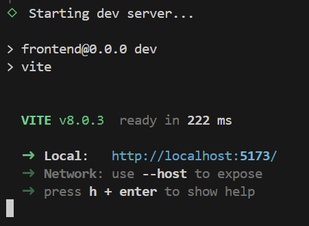
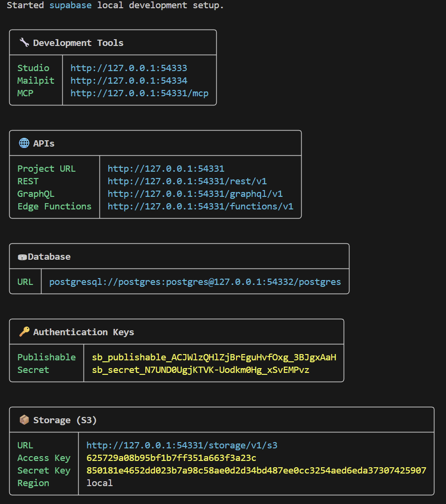

# Phase 2: Creating Your First Full Stack AI-Assisted Project

After completing Phase 1, you have all the foundational tools installed. Now you'll create your first real full stack project: a React frontend connected to a local Supabase database.

**Estimated Time: 30-45 minutes**

---

## Table of Contents

- [What You'll Build](#what-youll-build)
- [System Requirements](#system-requirements)
- [Using VS Code's Integrated Terminal](#using-vs-codes-integrated-terminal)
- [Step 1: Create the Project Folder](#step-1-create-the-project-folder)
- [Step 2: Initialize Git](#step-2-initialize-git)
- [Step 3: Create a .gitignore](#step-3-create-a-gitignore)
- [Step 4: Create the React + Vite Frontend](#step-4-create-the-react--vite-frontend)
  - [Step 4.1: Scaffold the Frontend](#step-41-scaffold-the-frontend)
- [Step 5: Set Up Local Supabase](#step-5-set-up-local-supabase)
  - [Step 5.1: Initialize Supabase](#step-51-initialize-supabase)
  - [Step 5.2: Start Local Supabase](#step-52-start-local-supabase)
  - [Step 5.3: Install the Supabase Agent Skill](#step-53-install-the-supabase-agent-skill)
  - [Step 5.4: Generate the Schema with Copilot](#step-54-generate-the-schema-with-copilot)
  - [Step 5.5: Generate Seed Data with Copilot](#step-55-generate-seed-data-with-copilot)
- [Step 6: Connect Frontend to Supabase](#step-6-connect-frontend-to-supabase)
  - [Step 6.1: Install the React Agent Skill](#step-61-install-the-react-agent-skill)
  - [Step 6.2: Create the Environment Variables File](#step-62-create-the-environment-variables-file)
  - [Step 6.3: Generate TypeScript Types from the Database](#step-63-generate-typescript-types-from-the-database)
  - [Step 6.4: Generate the Frontend with Copilot](#step-64-generate-the-frontend-with-copilot)
- [Step 7: Start the Frontend](#step-7-start-the-frontend)
- [Step 8: Create a README](#step-8-create-a-readme)
- [Step 9: Initial Commit & Publish to GitHub](#step-9-initial-commit--publish-to-github)
- [Step 10: Deploy to Production](#step-10-deploy-to-production)
  - [Step 10.1: Push Schema to Supabase Cloud](#step-101-push-schema-to-supabase-cloud)
  - [Step 10.2: Get Your Cloud Credentials](#step-102-get-your-cloud-credentials)
  - [Step 10.3: Deploy Frontend to Vercel](#step-103-deploy-frontend-to-vercel)
- [Step 11: Fix Auth Email Redirect in Production](#step-11-fix-auth-email-redirect-in-production)

---

## What You'll Build

By the end of this phase, you'll have:
- **React + Vite frontend** running at `localhost:5173`
- **Local Supabase database** running via Docker
- **Frontend connected to backend** via the Supabase JS client
- **GitHub Copilot configured** for your project
- **Project published** to GitHub

**Project structure:**
```
my-first-fullstack/
├── frontend/           # React + Vite app
│   ├── src/
│   ├── package.json
│   └── .env.local      # local Supabase credentials (never committed)
├── supabase/           # Created automatically by `supabase init`
│   ├── config.toml
│   ├── migrations/
│   └── functions/
├── .gitignore
└── README.md
```

---

## System Requirements

**Prerequisites**: Complete Phase 1 installation guide
- Git, GitHub account, VS Code, Node.js, npm installed
- GitHub Copilot subscription active (preferred model: **Claude Sonnet 4.6**)
- Supabase account created (from Phase 1, Step 7)
- Docker Desktop running

---

## Using VS Code's Integrated Terminal

All shell commands in this guide run in VS Code's **integrated terminal** — a PowerShell prompt built directly into the editor. This keeps you in one window with code and terminal side by side.

**To open the integrated terminal:**
- Press **Ctrl+`** (backtick — the key below Escape)
- Or go to **Terminal → New Terminal** in the menu bar

VS Code opens a PowerShell terminal pre-set to your project's root folder. **Run all commands from this terminal unless a step says otherwise.**

> **Tip**: Open a second terminal pane with the **+** button in the terminal panel. You'll need two terminals in Step 8 — one for Supabase, one for the frontend dev server.

---

## Step 1: Create the Project Folder

Open PowerShell (Start menu → type `powershell`) and run:

```powershell
mkdir C:\Projects\my-first-fullstack
cd C:\Projects\my-first-fullstack
code .
```

This creates the folder and opens it in VS Code. From this point, use the **integrated terminal** (`Ctrl+``) for all commands.

> **VS Code GUI alternative**: **File → Open Folder** → navigate to `C:\Projects` → **New Folder** → `my-first-fullstack` → **Select Folder**.

---

## Step 2: Initialize Git

In the integrated terminal:

```powershell
git init
```

> **VS Code GUI alternative**: Click **Source Control** (`Ctrl+Shift+G`) → **"Initialize Repository"**.

---

## Step 3: Create a .gitignore

This is the first file you create — before any code — so nothing sensitive ever accidentally gets committed.

In the terminal:

```powershell
New-Item .gitignore
code .gitignore
```

Paste the following and save (`Ctrl+S`):

```
# Frontend dependencies (re-installed via npm install)
frontend/node_modules/

# Environment variables (contain API keys — never commit)
.env
.env.local
.env*.local

# MCP config (contains API tokens — never commit)
.vscode/mcp.json

# Build output
frontend/dist/

# Installed Packages
frontend/node_modules/

# Supabase local runtime data
supabase/.branches/
supabase/.temp/

# OS files
.DS_Store
Thumbs.db
```

---

## Step 4: Create the React + Vite Frontend

### Step 4.1: Scaffold the Frontend

In the terminal:

```powershell
npm create vite@latest frontend -- --template react
```
When prompted, select yes:
```powershell
◇  Install with npm and start now?
│  Yes
```

Vite scaffolds the app, installs dependencies, and starts the dev server automatically.

Verify it runs by clicking on the link `http://localhost:5173` with `Ctrl + left click`. 
Or manually type `http://localhost:5173` in your browser.
You should see the default Vite + React page.  

  
Press `Ctrl+C` in the shell to stop it when done.

---

## Step 5: Set Up Local Supabase

### Step 5.1: Initialize Supabase

After pressing `Ctrl+C` to stop the Vite dev server, your terminal is still inside the `frontend/` folder. Navigate back to the project root first:

```powershell
cd ..
```

Confirm you're in the right place — the prompt should show `C:\Projects\my-first-fullstack>`. Then run:

```powershell
supabase init
```

This creates a `supabase/` folder with:
- `config.toml` — local Supabase configuration
- `migrations/` — database schema files
- `functions/` — serverless edge functions

### Step 5.2: Start Local Supabase

Make sure Docker Desktop is running, then:

```powershell
supabase start
```

This pulls Docker images on first run (may take a few minutes), then starts a full local Supabase stack. When complete, you'll see output like:



**Copy the `Publishable` key** — you'll need it in the next step.

> **Note**: Supabase Studio (local admin UI) is now running at `http://localhost:54323`.

You can save the whole output to a text file for future reference.

### Step 5.3: Install the Supabase Agent Skill

From this point we'll use **agentic development** — rather than writing SQL by hand, we ask GitHub Copilot to generate it using a skill that knows Supabase Postgres best practices.

In the terminal, install the skill into your project:

```powershell
npx skills add supabase/agent-skills
```

The CLI will prompt you twice. Answer as follows:

**1. Select your agent — choose Claude Code:**
```
◆  Select agents to install for
│  ── Additional agents ─────────────────────────────
│
│   ○ Augment (.augment/skills)
│ ❯ ● Claude Code (.claude/skills)
│
│  ↑↓ move, space select, enter confirm
```
Press `Enter` to skip and again to confirm.

**2. Select installation scope — choose Project:**
```
◆  Installation scope
│  ● Project (Install in current directory (committed with your project))
│  ○ Global
```
**Project** should already be selected. Press `Enter` to confirm.

> **Why Project?** Installing at the project level commits the skill rules alongside your code in `.agents/skills/`. Every developer who clones the repo gets the same Copilot behavior automatically. Global installs only affect your machine.

This installs the [supabase-postgres-best-practices](https://github.com/supabase/agent-skills) skill locally into `.agents /skills/`. Copilot will automatically reference it when working on database-related tasks in this project.

> **What is a skill?** A skill is a set of rules and patterns that Copilot loads before generating code. The Supabase skill teaches Copilot things like: use `(select auth.uid())` in RLS policies (not bare `auth.uid()`), always index foreign key columns, prefer `bigint identity` over `serial`, use `timestamptz` not `timestamp`, etc.

### Step 5.4: Generate the Schema with Copilot

Before writing any code, we'll define what we're building: a **notes app** where each user has their own private notes. Users can create, read, update, and delete their own notes — but cannot see anyone else's. This is a common real-world pattern: a personal workspace scoped to the authenticated user.

The data model is simple:
- `users` — one row per authenticated user (linked to Supabase Auth)
- `notes` — many notes per user, each with a title and content

Row Level Security (RLS) enforces the privacy at the database level, so even if the frontend has a bug, users can never access each other's data.

Open GitHub Copilot Chat (`Ctrl+Alt+I`) and type this prompt exactly:

```
/supabase-postgres-best-practices create a test project schema, include users, notes tables. each user will have multiple notes. add rls policies for users to be able to edit their own notes only.
```

Copilot will generate a migration file in `supabase/migrations/` with:
- A `users` table extending `auth.users`
- A `notes` table with a foreign key to `users`
- An index on `notes.user_id` (required for fast JOINs and RLS)
- Separate `SELECT`, `INSERT`, `UPDATE`, and `DELETE` RLS policies using the performance-safe `(select auth.uid())` pattern

Once generated, apply the migration to your local database:

```powershell
supabase migration up
```

> **`migration up`** applies any pending migrations to your local database without wiping it. Use this whenever you add a new migration and want to preserve existing data.

### Step 5.5: Generate Seed Data with Copilot

The schema is set up, but the database is empty. To test the frontend without having to sign up and create notes manually, we'll seed the database with a few test users and notes.

Open GitHub Copilot Chat (`Ctrl+Alt+I`) and type this prompt:

```
/supabase-postgres-best-practices generate supabase/seed.sql for a notes app
```

Copilot should generate `supabase/seed.sql` with:
- `INSERT` statements into `auth.users` for 3 test users with fixed UUIDs and hashed passwords
- `UPDATE` statements on `public.users` to set `full_name` (the trigger creates the row, this fills in the rest)
- Several notes per user with realistic content and varied timestamps

Review the file before running it. Then apply it to your local database:

```powershell
supabase db reset
```

`supabase db reset` automatically runs `supabase/seed.sql` if the file exists — no extra flag needed. You now have real data to look at when you open the frontend.

> **Tip**: Seed data is for local development only. `supabase/seed.sql` is committed to git so every developer on the team starts with the same test data. **Never** run `supabase db reset` against a production database.

---

## Step 6: Connect Frontend to Supabase

### Step 6.1: Install the React Agent Skill

Just like we used a skill to generate the database schema, we'll use a skill to generate the frontend — one that knows React and Vercel best practices.

In the terminal:

```powershell
npx skills add vercel-labs/agent-skills
```

The CLI will prompt you twice. Answer the same way as before:

**1. Select your agent — skip additional agents:**
```
◆  Select agents to install for
│  ── Additional agents ─────────────────────────────
│
│   ○ Augment (.augment/skills)
│ ❯ ○ Claude Code (.claude/skills)
│
│  ↑↓ move, space select, enter confirm
```
Press `Enter` to skip — no additional agents need to be selected.

**2. Select installation scope — choose Project:**
```
◆  Installation scope
│  ● Project (Install in current directory (committed with your project))
│  ○ Global
```
Press `Enter` to confirm **Project**.

This installs the `vercel-react-best-practices` skill into `.claude/skills/`. Copilot will use it to generate idiomatic React code with correct patterns for data fetching, loading states, error handling, and component structure.

### Step 6.2: Create the Environment Variables File

Credentials are instance-specific — they can't be generated by Copilot. You need to get them from your running Supabase instance.

**Where to find your `Publishable` key:**

**Option A — From the `supabase start` output** (Step 5.2):
If you saved it, copy it. It's labelled `Publishable` under **Authentication Keys** in the output.

**Option B — Run `supabase status`** (if you've already closed that terminal):
```powershell
supabase status
```
This reprints the full connection info including the `Publishable` key.

**Option C — Supabase Studio**:
Open `http://localhost:54323` → **Project Settings** (gear icon) → **API** → copy the `Publishable` key under **Authentication Keys**.

---

Once you have the key, create the file:

```powershell
New-Item frontend\.env.local
code frontend\.env.local
```

Paste the following, replacing the placeholder with your actual `Publishable` key:

```
VITE_SUPABASE_URL=http://localhost:54321
VITE_SUPABASE_ANON_KEY=paste_your_publishable_key_here
```

Save with `Ctrl+S`.

> **Security**: `.env.local` is already in your `.gitignore`. This file is never committed — every developer creates their own from their local `supabase start` output.

### Step 6.3: Generate TypeScript Types from the Database

Supabase can introspect your local database and generate a TypeScript types file that mirrors your schema exactly. This gives Copilot (and you) full type safety when writing frontend code — autocompletion on table names, column names, and return types.

In the terminal from the /supabase folder:

```powershell
supabase gen types typescript --local > ../frontend/src/database.types.ts
```

This connects to your locally running Supabase Docker container (started in Step 5.2) and introspects the database schema, writing `frontend/src/database.types.ts` with a complete type definition for every table, view, and function. `supabase start` must be running for this command to work.

> **Re-run this command** whenever you change the schema (add a column, create a table, etc.) to keep the types in sync with the database.

> **Tip**: Add this to your Quick Reference — it's a command you'll run often during development.

### Step 6.4: Generate the Frontend with Copilot

This step uses a two-phase agentic workflow: **Plan first, then implement**. Planning lets you review what Copilot intends to build before it touches any files.

---

#### Phase 1 — Plan

Switch Copilot Chat to **Plan mode**: click the mode dropdown in the chat panel and select **Plan** (or press `Ctrl+Alt+I` to open chat, then change the mode selector from "Ask" to "Plan").

Type this prompt:

```
/vercel-react-best-practices Build a notes app frontend with Supabase Auth. Users should be able to sign up, log in, and manage their own private notes.
Use generated database types. Use existing .env file. Update readme with detailed explanations of what has been created wnd why.
```

Copilot will respond with a **plan**: a list of files it intends to create or modify, the component structure, and the data flow. **Read through it carefully.** If anything is missing or wrong, ask Copilot to revise the plan before proceeding.

---

#### Phase 2 — Implement

Once you're satisfied with the plan, switch to **Agent mode**: click the mode selector and choose **Agent**, or click the **"Implement"** button that appears below the plan in the chat.

Copilot will create and write all the files automatically:
- `frontend/src/supabase.js` — Supabase client
- `frontend/src/database.types.ts` — already generated in Step 6.3
- `frontend/src/pages/AuthPage.jsx` — sign-up / login form
- `frontend/src/pages/NotesPage.jsx` — notes list, add form, delete
- `frontend/src/App.jsx` — routing and auth guard

Review created files and study readme.md - it should explain the logic behind each change. 

---

## Step 7: Start the Frontend

Supabase is still running from Step 5. All you need to do is start the React dev server.

Your terminal is currently inside the `supabase/` folder. Navigate to the frontend:

```powershell
cd ..\frontend
npm run dev
```

Open `http://localhost:5173`. You'll land on the sign-up / login page.

**Create a test account:**
1. Click **Sign up**
2. Enter an email and password (e.g. `test@example.com` / `password123`)
3. You'll be redirected to the notes page — logged in and ready

**Try the app:**
- Add a note using the form
- Delete a note
- Sign out and sign back in — your notes persist in the local database

Your frontend is now reading and writing live data from local Supabase.

---

## Step 8: Create a README

Press `Ctrl+C` to stop the dev server. Your terminal is inside `frontend/` — navigate back to the project root:

```powershell
cd ..
```

Open Copilot Chat (`Ctrl+Alt+I`) in **Agent mode** and type:

```
Create a README.md for this project. It should explain what the app does, the tech stack, the folder structure, and how to run it locally from scratch. Include all the commands needed — starting Supabase, generating types, and starting the frontend. Keep it practical and developer-focused.
```

Copilot will generate `README.md` based on your actual project files. Review it and ask for adjustments if needed.

---

## Step 9: Initial Commit & Publish to GitHub

---

**Step 1 — Create the repository on GitHub:**

1. Go to [github.com](https://github.com) and sign in
2. Click **+** (top right) → **New repository**
3. Name it `my-first-fullstack` and set visibility to **Public**
4. Click **Create repository**
5. GitHub shows a quick setup page — copy the repo URL (e.g. `git@githib.com:art-mx/my-first-fullstack.git`)

**Step 2 — Commit your files in VS Code:**

1. Click **Source Control** (`Ctrl+Shift+G`) in the sidebar
2. Click **+** next to **Changes** to stage all files
3. Type `Initial commit: React + Vite frontend with Supabase backend` in the message box
4. Click **✓ Commit**

> **Terminal alternative:**
> ```powershell
> git add .
> git commit -m "Initial commit: React + Vite frontend with Supabase backend"
> ```

**Step 3 — Connect and push:**

1. In the Source Control panel, click **⋯** (More Actions) → **Remote** → **Add Remote...**
2. Paste the repo URL you copied from GitHub
3. Name it `origin` when prompted
4. Click **⋯** → **Push** to upload your commits

> **Terminal alternative:**
> ```powershell
> git remote add origin https://github.com/your-username/my-first-fullstack.git
> git branch -M main
> git push -u origin main
> ```

---

**Verify**: Open `https://github.com/your-username/my-first-fullstack` in your browser.

---

## Step 10: Deploy to Production

Your app runs locally — now ship it. The frontend goes to Vercel, the database goes to Supabase Cloud.

---

### Step 10.1: Push Schema to Supabase Cloud

**Create a Supabase Cloud project:**
1. Go to [supabase.com](https://supabase.com) and sign in
2. Click **New project**
3. Choose a name (e.g. `my-first-fullstack`) and a strong database password — **save this password**, you'll need it
4. Select a region close to you
5. Click **Create new project** and wait ~2 minutes for it to provision

**Link your local project to the cloud project:**

In the terminal (from the project root):

```powershell
supabase login
supabase link
```

`supabase link` will prompt you to select your project from the list. Select `my-first-fullstack`.

**Push your migrations:**

```powershell
supabase db push
```

This runs all your migration files against the cloud database. Your schema — tables, RLS policies, indexes — is now live in production.

> **Note**: `supabase db push` does not push seed data. Seed data is for local development only.

---

### Step 10.2: Get Your Cloud Credentials

You need the production API URL and `Publishable` key for the Vercel environment variables.

1. Go to your Supabase Cloud project dashboard — both values are shown on the project home page
2. Find:
   - **Project URL** (looks like `https://abcdefgh.supabase.co`)
   - **Publishable key** key (looks like `sb_publishable...`)

!(supabase-creds)[screenshots/supabase-creds.png] 

Keep these handy — you'll paste them into Vercel in the next step.  

---

### Step 10.3: Deploy Frontend to Vercel

**Import your GitHub repo:**
1. Go to [vercel.com](https://vercel.com) and sign in with GitHub
2. Click **Add New → Project**
3. If this is your first time, Vercel will ask you to install the **Vercel GitHub App** — click **Install** and authorize it on your GitHub account. You can grant access to all repositories or just the one you're deploying.
4. Find `my-first-fullstack` in the list and click **Import**
4. Set the **Root Directory** to `frontend`
5. Under **Environment Variables**, add:
   - `VITE_SUPABASE_URL` → your Supabase Cloud `Project URL`
   - `VITE_SUPABASE_ANON_KEY` → your Supabase Cloud `Publishable key`
6. Click **Deploy**

Vercel builds your React app and gives you a live URL (e.g. `https://my-first-fullstack.vercel.app`).

> **Tip**: Every time you push a commit to GitHub, Vercel automatically rebuilds and redeploys — no manual action needed. The deployment type depends on the branch:
> - **`main`** → Production deployment at your public URL (e.g. `https://my-first-fullstack.vercel.app`)
> - **Any other branch** → Preview deployment at a unique URL only accessible to you and your team — useful for reviewing changes before merging

---

**Verify**: Open your Vercel URL in the browser, sign up with a new account, create a note — it's running on real infrastructure.

---

## Step 11: Fix Auth Email Redirect in Production

There's a known issue with Supabase Auth in production: by default, confirmation and password-reset emails contain links that point to `http://localhost:3000` instead of your live Vercel URL. Users who click the link in their email will land on a broken page.

This happens because Supabase's **Site URL** defaults to localhost and needs to be updated to match your production deployment.

**Fix it in the Supabase dashboard:**

1. Go to your [Supabase Cloud project](https://supabase.com) and open the project
2. In the left sidebar, click **Authentication** → **URL Configuration**
3. Set **Site URL** to your Vercel production URL (e.g. `https://my-first-fullstack.vercel.app`)
4. Under **Redirect URLs**, click **Add URL** and add:
   - `https://my-first-fullstack.vercel.app/**`
5. Click **Save**

> **Why the wildcard?** The `/**` pattern allows Supabase to redirect to any path on your domain after email confirmation — such as `/dashboard` or `/notes` — depending on where your app routes the user post-login.

> **Local development still works**: Your local `http://localhost:5173` is automatically included in Supabase's allowlist for local development, so you don't need to add it here.

**Verify**: Sign up with a new account on your Vercel URL. The confirmation email link should now redirect back to your live app, not localhost.

---

## Summary

You've completed Phase 2. Here's what you built:

- **React + Vite frontend** scaffolded and running locally at `localhost:5173`
- **Local Supabase database** running via Docker with a `users` + `notes` schema, RLS policies, and seed data
- **Frontend connected to Supabase** using environment variables and generated TypeScript types
- **GitHub Copilot configured** with Supabase and React agent skills for agentic development
- **Project published** to GitHub with an initial commit
- **Production deployment** live on Vercel with the schema pushed to Supabase Cloud

**Next**: Continue to [Phase 3](#) to extend the app — adding features, refining the schema, and building with AI assistance as a daily workflow.

---

## Quick Reference: PowerShell Command Cheat Sheet

Common commands you'll use during development:

```powershell
# Git
git status
git add .
git commit -m "message"
git push
git pull

# Node & npm (from project root)
npm install                    # Install all dependencies
npm run dev                    # Start dev server
npm run build                  # Build for production
npm test                       # Run tests
npm install -g <package>      # Install globally

# Workspace commands (from root)
npm install -w apps/frontend  # Install in specific workspace
npm run dev -w apps/frontend  # Run dev in specific workspace

# VS Code
code .                         # Open current directory
code <file>                    # Open specific file

# Docker
docker ps                      # List running containers
docker ps -a                   # List all containers
docker logs <container-name>   # View container logs

# Supabase (local)
supabase start                 # Start local instance
supabase stop                  # Stop local instance
supabase status                # Check status
supabase migration new <name>  # Create new migration

# Vercel
vercel                         # Deploy (interactive)
vercel env pull                # Pull environment variables
vercel logs                    # View deployment logs
```

---

## Troubleshooting

### "Email rate limit exceeded" during sign-up

**Symptom**: Supabase returns an `Email rate limit exceeded` error when trying to sign up or trigger a password reset.

**Cause**: Supabase's free tier limits auth emails (confirmation, password reset) to **4 emails per hour** per project via their shared SMTP service. Repeatedly testing the sign-up flow quickly exhausts this limit.

**Fix — Option A: Disable email confirmation while testing**

For development and testing against your production project, turn off mandatory email confirmation:

1. Supabase dashboard → **Authentication** → **Providers** → **Email**
2. Toggle off **"Confirm email"**
3. Re-enable it before going live with real users

**Fix — Option B: Test sign-up against your local instance**

Use `supabase start` and test at `http://localhost:5173` — local Supabase captures all emails in **Inbucket** at `http://localhost:54324` with no rate limits. This is the safest approach for iterating on auth flows.

**Fix — Option C: Reuse the same test email**

Signing up again with the same email address (e.g. `test@example.com`) typically triggers a resend rather than a new allocation, reducing how quickly you hit the limit.

---